# Diagramas de Casos de Uso por Microservicio - Perfulandia SPA

Este documento resume los casos de uso principales expuestos por los controladores REST de cada microservicio.

## Gateway

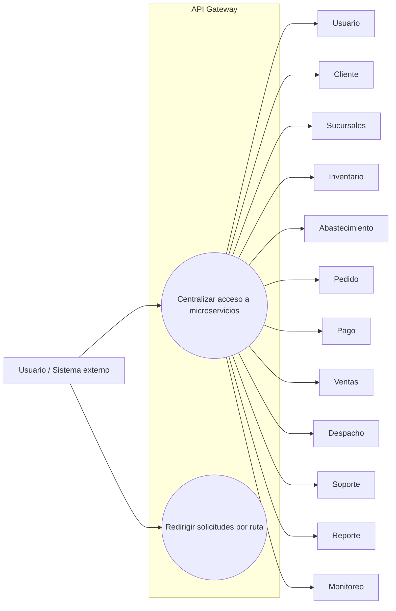

## Usuario

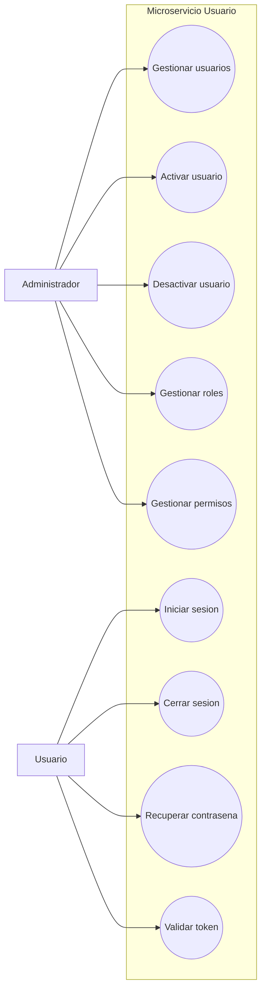

## Cliente

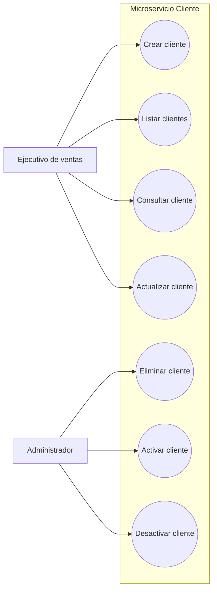

## Sucursales

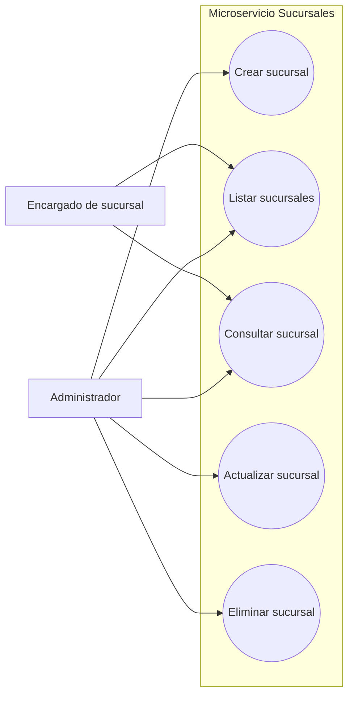

## Inventario / Perfume

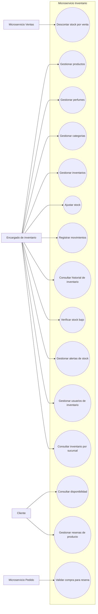

## Abastecimiento

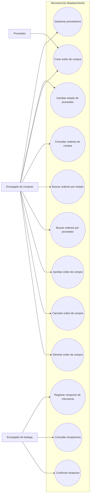

## Pedido

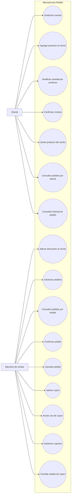

## Pago

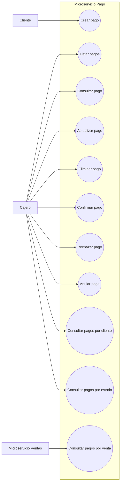

## Ventas

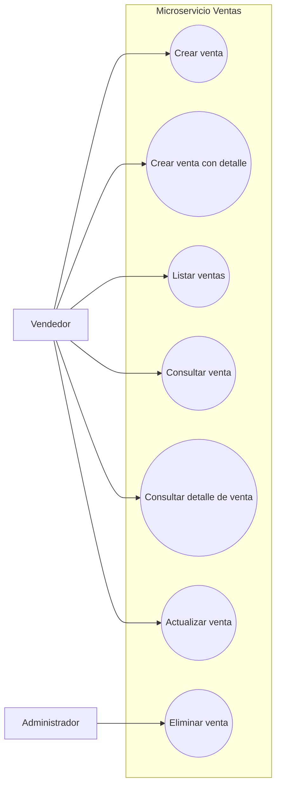

## Despacho

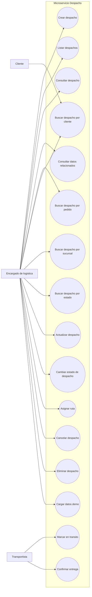

## Soporte

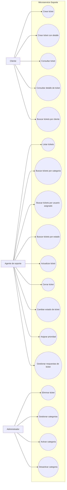

## Reporte

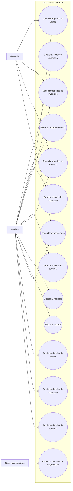

## Monitoreo

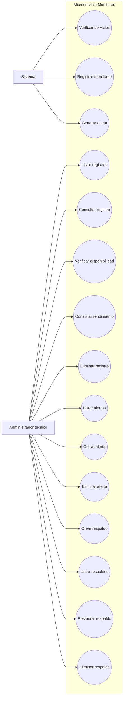
