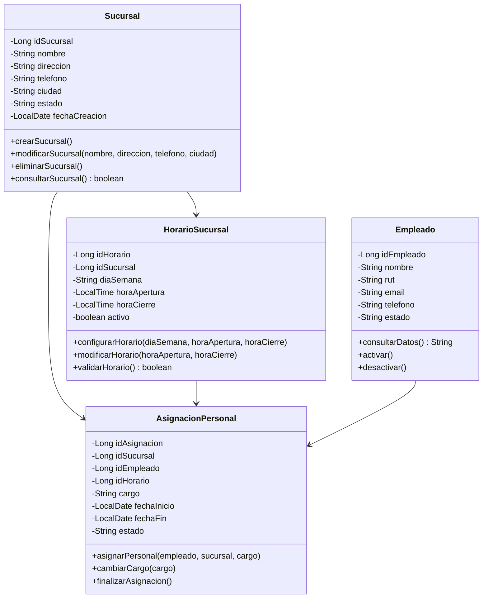

# Microservicio Sucursales - Diagrama de Clases

```mermaid
classDiagram
    class Sucursal {
        -Long idSucursal
        -String nombre
        -String direccion
        -String telefono
        -String ciudad
        -String estado
        -LocalDate fechaCreacion
        +crearSucursal()
        +modificarSucursal(nombre, direccion, telefono, ciudad)
        +eliminarSucursal()
        +consultarSucursal() boolean
    }

    class HorarioSucursal {
        -Long idHorario
        -Long idSucursal
        -String diaSemana
        -LocalTime horaApertura
        -LocalTime horaCierre
        -boolean activo
        +configurarHorario(diaSemana, horaApertura, horaCierre)
        +modificarHorario(horaApertura, horaCierre)
        +validarHorario() boolean
    }

    class AsignacionPersonal {
        -Long idAsignacion
        -Long idSucursal
        -Long idEmpleado
        -Long idHorario
        -String cargo
        -LocalDate fechaInicio
        -LocalDate fechaFin
        -String estado
        +asignarPersonal(empleado, sucursal, cargo)
        +cambiarCargo(cargo)
        +finalizarAsignacion()
    }

    class Empleado {
        -Long idEmpleado
        -String nombre
        -String rut
        -String email
        -String telefono
        -String estado
        +consultarDatos() String
        +activar()
        +desactivar()
    }

    Sucursal --> HorarioSucursal
    Sucursal --> AsignacionPersonal
    HorarioSucursal --> AsignacionPersonal
    Empleado --> AsignacionPersonal
```
